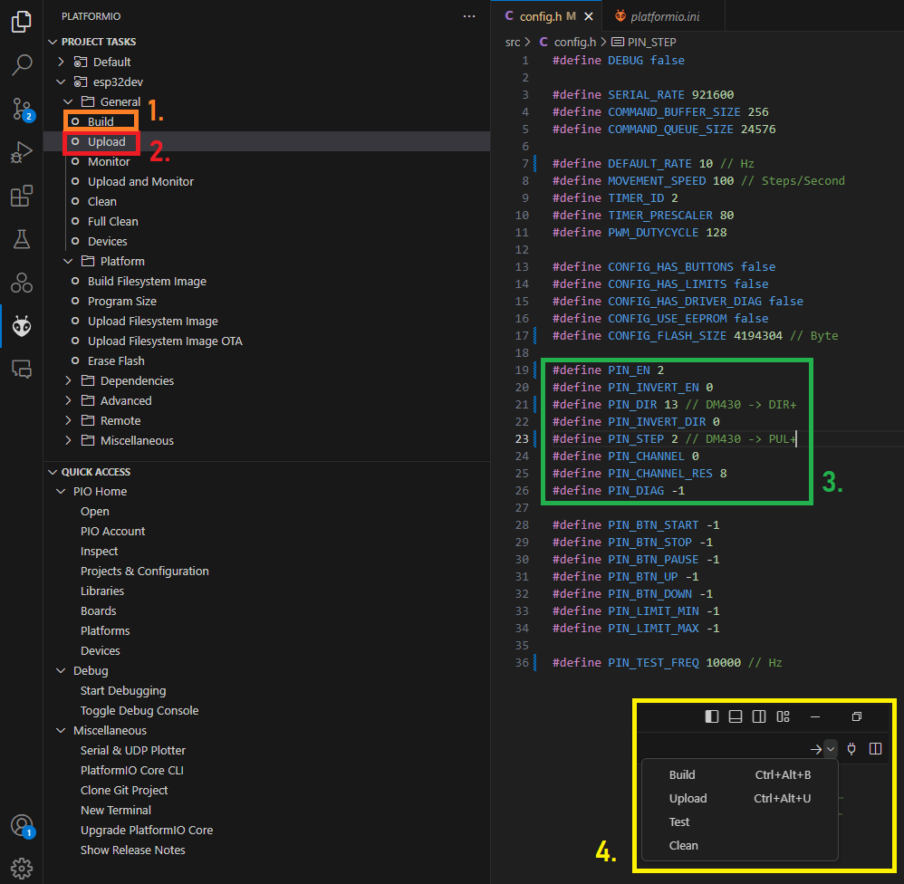
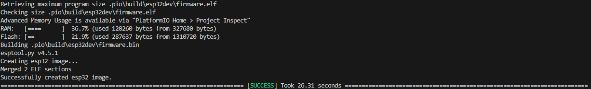
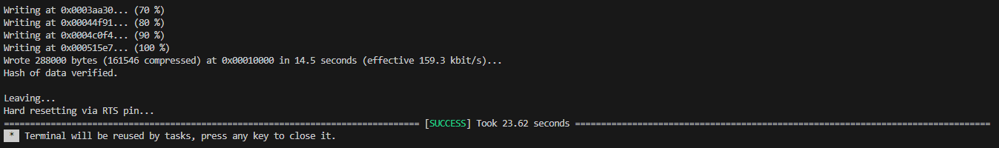
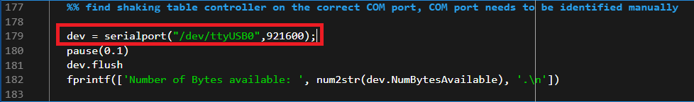
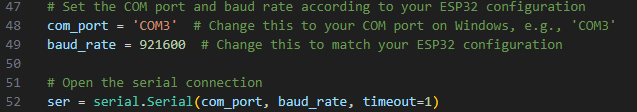

# Namazu: Low-cost tunable shaking table for vibration experiments under generic signals

This repository represents supplementary material to the publication "2024 Grashorn et la. - Namazu: Low-cost tunable shaking table for vibration experiments under generic signals" published in Experimental Techniques. The repository contains software, coded examples, firmware, and CAD files usable for vibrational experiments in the context of dynamic analysis of structures and stochastic dynamics in general.

Updates 10.06.2024

# Preparations

When this readme was written following OS, platforms, and software was used:

- Windows 10.0.19041.4355 (professional)
- Microsoft Visual Studio Code 1.90.0 (VSC)
- MATLAB version 2023a
- Python version 3.12.3
- PlatformIO with Core 6.1.15 and Home 3.4.4

# Flashing of ESP32

Connect the ESP32 via a micro USB cable with your computer and identify the USB port by e.g. device manager or PlatformIO.

In windows you should located something like this:
"Port: COM3; Description: Silicon Labs CP210x USB to UART Bridge (COM3); Hardware: USB VID:PID=10C4:EA60 SER=0001 LOCATION=1-6"
The port ``` COM3 ``` could have a different number on your machine, depending on the USB socket you used.
In Linux the port is displayed differently (e.g. ```/dev/ttyUSB0```), but the description should remain the same.

Start VSC, locate and navigate to the Firmware folder (``\Firmware\``), start PlatformIO (in VSC), make sure the ESP32 has been located as described above.
Press build. As indicated by <span style="color:orange"> *1.* </span> in Figure 1 below. Alternatively you can also use the buttons in the top-right corner, see <span style="color:yellow"> *4.* </span> Figure 1.



Figure 1: PlatformIO.


A successful build should reveal this:



Figure 2: Build.


Then upload the build by pressing the upload button (inicated by <span style="color:red"> *2.* </span> in Figure 1 above) in PlatformIO.

A successful upload should display this:



Figure 3: Upload.


The connecting pins of your ESP32 to the driver (in our case we used a DM430) are given in the window as in <span style="color:green"> *3.* </span> in Figure 1.

We advice you to not change or touch the firmware software in ``\Firmware\``, unless you know what you are doing.


# Start with a main file

We provided coded examples and implementations for MATLAB and Python. Once you have your hardware ready and safety precautions were taken, we suggest to start with simple examples.

## MATLAB

For MATLAB, go to ```\MATLAB\MainCreateSimulation.m```.

Make sure the correct com port is stated. If ran successfully a fixed harmonic with amplitude 1 and frequency 1 is started.



## Python

For Python, go to ```\Python\main_FixedHarmonic.py```.

Make sure the correct com port is stated. If ran successfully a fixed harmonic with amplitude 1 and frequency 1 is started.




## Disclaimer
1. Content.
The author reserves the right not to be responsible for the topicality, correctness, completeness or quality of the information provided. Liability claims regarding damage caused by the use of any information provided, including any kind of information which is incomplete or incorrect, will therefore be rejected.
All offers are not-binding and without obligation. Parts of the pages or the complete publication including all offers and information might be extended, changed or partly or completely deleted by the author without separate announcement.
2. Referrals and links.
The author is not responsible for any contents linked or referred to from his pages - unless he has full knowledge of illegal contents and would be able to prevent the visitors of his site fromviewing those pages. If any damage occurs by the use of information presented there, only the author of the respective pages might be liable, not the one who has linked to these pages. Furthermore the author is not liable for any postings or messages published by users of discussion boards, guestbooks or mailinglists provided on his page.
3. Copyright.
The author intended not to use any copyrighted material for the publication or, if not possible, to indicate the copyright of the respective object.
The copyright for any material created by the author is reserved. Any duplication or use of objects such as images, diagrams, sounds or texts in other electronic or printed publications is not permitted without the author's agreement.
4. Privacy policy.
No privacy data is collected.
5. Legal validity of this disclaimer.
This disclaimer is to be regarded as part of the internet publication which you were referred from. If sections or individual terms of this statement are not legal or correct, the content or validity of the other parts remain uninfluenced by this fact.