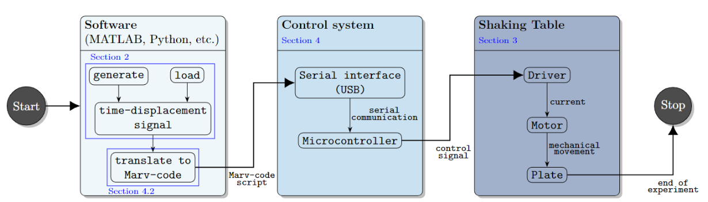
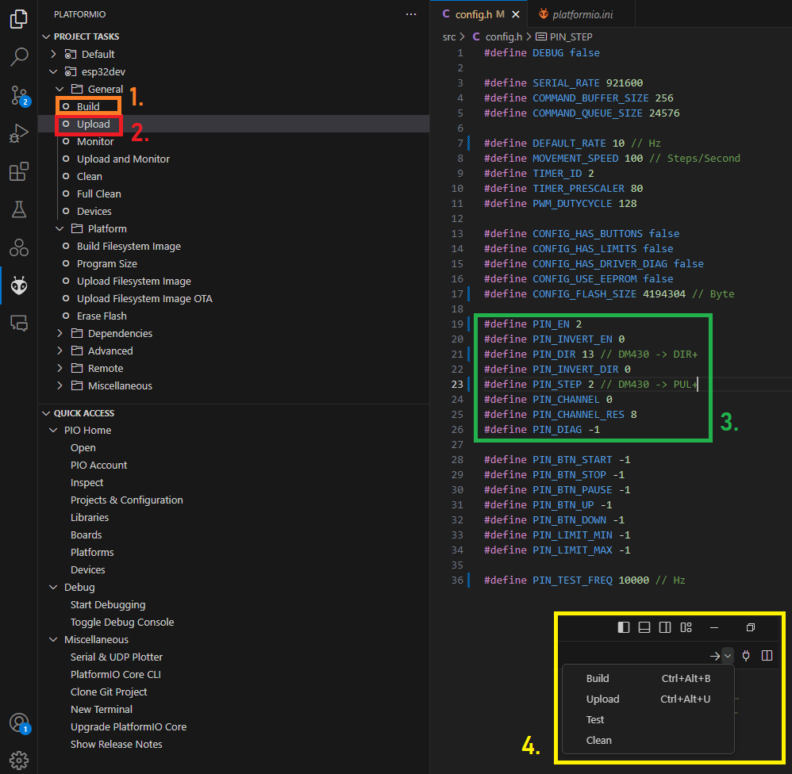
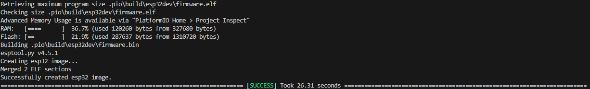
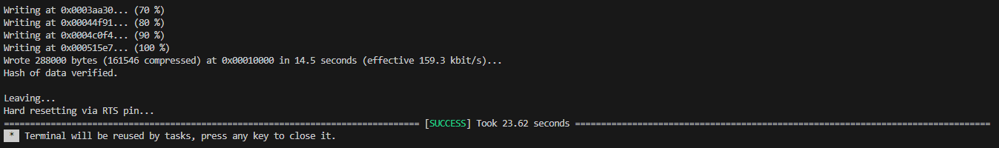
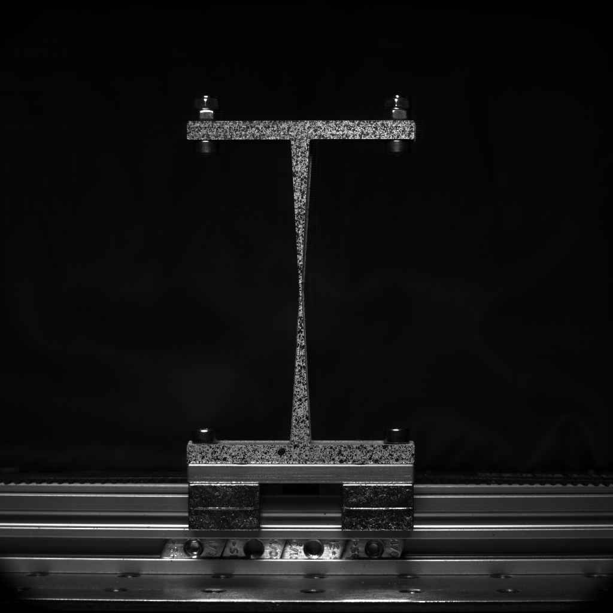

# Namazu: Low-cost tunable shaking table for vibration experiments under generic signals

This repository contains supplementary material to the publication ["2024 Grashorn, Bittner, Banse et al. - Namazu: Low-cost tunable shaking table for vibration experiments under generic signals"](https://doi.org/10.1007/s40799-024-00727-8) published in Experimental Techniques. The repository contains software, coded examples, firmware, and CAD files usable for vibrational experiments in the context of dynamic analysis of structures and stochastic dynamics in general.

Updates 17.06.2024

# Namazu architecture (Software & Hardware)



Figure 1: Flowchart and design concept of the Namazu framework, from signal generation via the software over the control system to plate motion, as in [our paper.](https://doi.org/10.1007/s40799-024-00727-8)

# Preparations

When this readme was written the following OS, platforms, and software were used:

- Windows 10.0.19041.4355 (professional)
- Microsoft Visual Studio Code 1.90.0 (VSC)
- MATLAB version 2023a
- Python version 3.12.3
- PlatformIO with Core 6.1.15 and Home 3.4.4

It is necessary to upload the firmware to a compatible ESP32 device. If this readme is not enough, you can find more information here: ["Namazu documentation"](https://namazu.de/). Please note that there are a multitude of ESP32 variants, so far we tested NodeMCU ESP32 WROOM32 and Firebeetle ESP32 modules. Please also note that we cannot test every variant and we are currently not recommending using ESP32-S2 or -C3 variants, since this could require code adaptations.

# Flashing of ESP32

Connect the ESP32 via a USB cable with your computer and identify the USB port by e.g. the device manager or PlatformIO.

In Windows you should located something like this:
"Port: COM3; Description: Silicon Labs CP210x USB to UART Bridge (COM3); Hardware: USB VID:PID=10C4:EA60 SER=0001 LOCATION=1-6"
The port ``` COM3 ``` could have a different number on your machine, depending on the USB socket you used.
In Linux the port is displayed differently (e.g. ```/dev/ttyUSB0```), but the description should remain the same.

Start VSC, locate and navigate to the Firmware folder (``\Firmware\``), start PlatformIO (in VSC), make sure the ESP32 has been located as described above.
To verify that everything is installed okay and no libraries are missing, press build. As indicated by <span style="color:orange"> *1.* </span> in Figure 2 below. Alternatively you can also use the buttons that are normally in the VSC UI located in the top-right corner, here see <span style="color:yellow"> *4.* </span> Figure 2.



Figure 2: PlatformIO.


A successful build should reveal this:



Figure 3: Build.


Then upload by pressing the upload button (inicated by <span style="color:red"> *2.* </span> in Figure 2 above) in PlatformIO. VSC will build again and then upload, the COM port should be identified automatically. 

A successful upload should display this:



Figure 4: Upload.


The connecting pins of your ESP32 to the driver (in our case we used a DM430) are given in the window as in <span style="color:green"> *3.* </span> in Figure 2.

We advise you to not change or touch the firmware software in ``\Firmware\``, unless you know what you are doing.

## Safety Precautions

Remember, if you built Namazu, you are dealing with machinery.


<span style="color:red">*Disclaimer*</span>: The authors assume no responsibility or liability for any use of the software and provided ideas. By using this software, you acknowledge that you are solely responsible for any consequences that may arise. It is your responsibility to ensure you fully understand the operation and potential risks associated with the software and any machinery or systems it controls.

<span style="color:red">*Safety Warning*</span>: Always ensure you have a reliable power switch or safety mechanism to completely disconnect the machinery from the power grid in case of an emergency. Thoroughly assess the risks and plan your actions carefully. Double-check all connections and settings before proceeding. Safety should always be your top priority.

# Start with a main file

We provided coded examples and implementations for MATLAB and Python. Once you have your hardware ready and safety precautions were taken, we suggest to start with simple examples.

## MATLAB

For MATLAB, go to ```\MATLAB\MainCreateSimulation.m```. Here check line 179.

Make sure the correct com port is stated. If ran successfully a fixed harmonic with amplitude 1 and frequency 1 is started.

```Matlab
%% find shaking table controller on the correct COM port, COM port needs to be identified manually

dev = serialport("COM3",921600);
```

## Python

For Python, go to ```\Python\main_FixedHarmonic.py```. There check line 47.

Make sure the correct com port is stated. If ran successfully a fixed harmonic with amplitude 1 and frequency 1 is started.

```py
# Set the COM port and baud rate according to your ESP32 configuration
com_port = 'COM3'  # Change this to your COM port on Windows, e.g., 'COM3'
baud_rate = 921600  # Change this to match your ESP32 configuration

# Open the serial connection
ser = serial.Serial(com_port, baud_rate, timeout=1)
```

## Cite

For technical paper:

Grashorn J., Bittner, M., Banse, M. et al. (2024). Namazu: Low-cost tunable shaking table for vibration experiments under generic signals [https://doi.org/10.1007/s40799-024-00727-8](https://doi.org/10.1007/s40799-024-00727-8)

BibTex:
```
@article{NamazuEXTE2024,
    author = {Grashorn J., Bittner, M., Banse, M., Chang, X., Beer, M., Fau, A.},
    title = {Namazu: Low-cost tunable shaking table for vibration experiments under generic signals},
    year = {2024},
    publisher = {Springer Nature},
    journal = {Experimental Techniques},
    doi = {10.1007/s40799-024-00727-8},
}
```

For the repository:

https://github.com/NamazuST/Namazu

doi: https://zenodo.org/doi/10.5281/zenodo.10533795

BibTex:
```
@misc{NamazuRepo2024,
    author = {Grashorn J., Bittner, M., Banse, M.},
    title = {Namazu},
    year = {2024},
    publisher = {GitHub},
    journal = {GitHub repository},
    doi = {10.5281/zenodo.10533795},
}
```

## Showcase



Figure 5: Experimental campaign with a Namazu realization, a 3D printed specimen and love

## Disclaimer
1. Content.
The author reserves the right not to be responsible for the topicality, correctness, completeness or quality of the information provided. Liability claims regarding damage caused by the use of any information provided, including any kind of information which is incomplete or incorrect, will therefore be rejected.
All offers are not-binding and without obligation. Parts of the pages or the complete publication including all offers and information might be extended, changed or partly or completely deleted by the author without separate announcement.
2. Responsibility. The authors assume no responsibility or liability for any use of the software and provided ideas. By using this software, you acknowledge that you are solely responsible for any consequences that may arise. It is your responsibility to ensure you fully understand the operation and potential risks associated with the software and any machinery or systems it controls.
3. Referrals and links.
The author is not responsible for any contents linked or referred to from his pages - unless he has full knowledge of illegal contents and would be able to prevent the visitors of his site fromviewing those pages. If any damage occurs by the use of information presented there, only the author of the respective pages might be liable, not the one who has linked to these pages. Furthermore the author is not liable for any postings or messages published by users of discussion boards, guestbooks or mailinglists provided on his page.
4. Copyright.
The author aims to use only non-copyrighted material or materials for which the author has obtained the necessary permissions. In cases where this is not possible, the copyright of the respective material will be indicated. The copyright for any original material created by the author is reserved. Duplication or use of such materials, including but not limited to images, diagrams, sounds, or texts, in other electronic or printed publications is permitted only under the terms of the included licenses:
    - Repository: Licensed under the Creative Commons Attribution-NonCommercial-ShareAlike 4.0 International (["CC BY-NC-SA 4.0"](https://creativecommons.org/licenses/by-nc-sa/4.0/)) license.
    - Technical Paper: Licensed under the Creative Commons Attribution 4.0 International (["CC BY 4.0"](https://creativecommons.org/licenses/by/4.0/)) license.
5. Privacy policy.
No privacy data is collected.
6. Legal validity of this disclaimer.
This disclaimer is to be regarded as part of the internet publication which you were referred from. If sections or individual terms of this statement are not legal or correct, the content or validity of the other parts remain uninfluenced by this fact.
